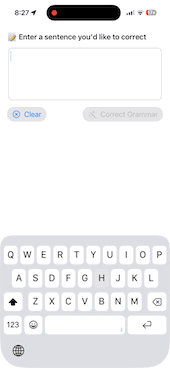

# FoundationModelsPlayground
A collection of on-device examples using Apple’s FoundationModels framework

---

## 🧪 Available Demos

### 1. 💬 On-device Chatbot  
A conversational chatbot that responds in a friendly tone.  
> ✅ Powered by `SystemLanguageModel`  
> ✅ Maintains short context history  
> ✅ Runs 100% locally on-device  

### 2. 📝 Grammar Correction  
An English tutor that checks your sentence, explains grammar mistakes, and provides corrections.  
> ✅ Powered by `SystemLanguageModel`  
> ✅ Offers detailed explanations  
> ✅ Runs 100% locally on-device  

---

## 💡 About FoundationModels

[FoundationModels](https://developer.apple.com/documentation/foundationmodels) is Apple’s official framework for running foundation language models on-device.  
These examples help developers explore capabilities like text generation, summarization, and natural dialogue — all without relying on cloud inference.

---
